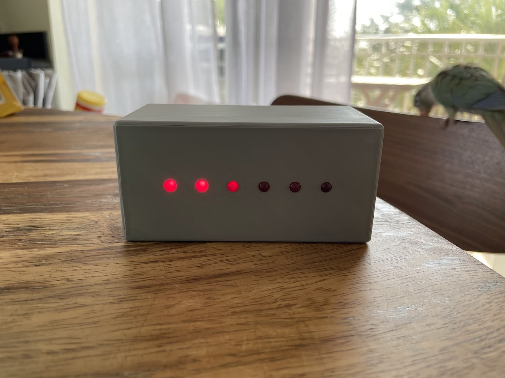
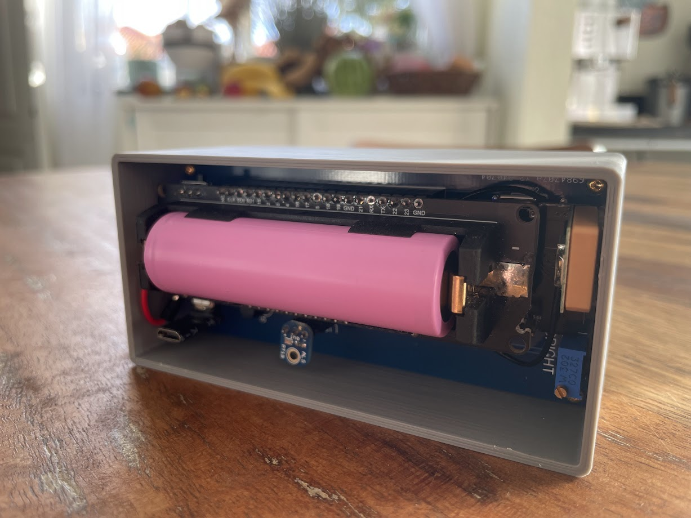

# Lumiere

I wanted a minimal-maintenance clock for my nightstand that is dim enough so it wouldn't disturb my sleep, and can be easily interpreted even in a drowsy middle-of-the-night state.

| Front    | Rear |
| -------- | ------- |
|   |     |

#### Time display using 6 red LED's

#### Automatic brightness adjustment
A light sensor on the back of the device is used to assess the ambient brightness and dim the LEDs accordingly. It's a good thing the device does not feature housing on the rear end, otherwise this might have been more complicated.

#### It is powered by a single 18650 cell, on which it runs for around 6 weeks.
The device spends most of its time in `light_sleep`, and only wakes up to query the clock and update LED brightness once a minute before going back to sleep.

Once the battery voltage drops below a "critical level", it enters `deep_sleep`, only waking up periodically to determine whether operation can continue.

#### It does not require any user input or configuration (except the occasional charge)
After turning it on, the current time is automatically received via GPS. Since there is no explicit timezone information available via GPS, at this time only GPS time is supported. There is a cool [project](https://github.com/HarryVienna/ESP32-Timezone-Finder-Component) that is able to determine timezones based on GPS coordinates by querying a previously prepared "timezone map".

## TODO
The state of this project is quite dirty, but it already does it's job surprisingly well.

Next up:

- TODO: Automatic timezone configuration (GPS-based)
- Wireless charging
- Proper housing
